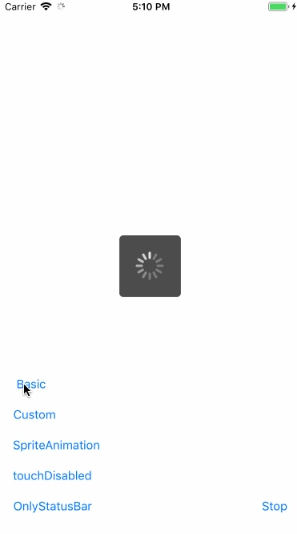
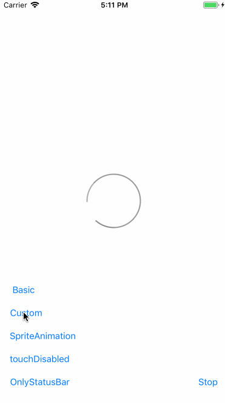
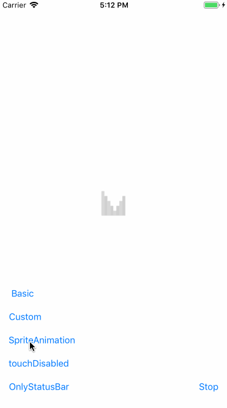

MKAIndicatorView
===

***MKAIndicatorView makes you to create the powerful indicator view easily.***

  

## Include in your iOS app

### CocoaPods

MKAIndicatorView is available through [CocoaPods](http://cocoapods.org). To install
it, simply add the following line to your Podfile:

```ruby
pod "MKAIndicatorView"
```

### Manual Installation

1. Download latest [MKAIndicatorView](https://github.com/HituziANDO/MKAIndicatorView/releases)
1. Drag & Drop MKAIndicatorView.framework into your Xcode project


## Usage

1. Import the module
	
	**Objective-C**
	
	```objc
	#import <MKAIndicatorView/MKAIndicatorView.h>
	```

	**Swift**
	
	```swift
	import MKAIndicatorView
	```

2. Show the indicator
	
	**Objective-C**
	
	```objc
	// Set default indicator.
	MKAIndicator *indicator = [MKAIndicator basicIndicatorWithActivityIndicatorViewStyle:UIActivityIndicatorViewStyleGray];
   [MKAIndicator setDefaultIndicator:indicator];
	[[MKAIndicator defaultIndicator] showInView:self.view withTouchDisabled:NO];
	```
	
	**Swift**
	
	```swift
	// Set default indicator.
	let indicator = MKAIndicator.basicIndicator(with: .gray)
	MKAIndicator.setDefault(indicator)
	MKAIndicator.default().show(in: self.view, withTouchDisabled: false)
	```

3. Hide the indicator
	
	**Objective-C**
	
	```objc
	[[MKAIndicator defaultIndicator] hide];
	```
	
	**Swift**
	
	```swift
	MKAIndicator.default().hide()
	```

### Basic Type

**Objective-C**

```objc
// Show basic indicator.
MKAIndicator *indicator = [[MKAIndicator basicIndicatorWithActivityIndicatorViewStyle:UIActivityIndicatorViewStyleWhiteLarge]
                                         addBlackBackgroundView];
[MKAIndicator setDefaultIndicator:indicator];
[[MKAIndicator defaultIndicator] showInView:self.view withTouchDisabled:NO];
```

**Swift**

```swift
// Show basic indicator.
let indicator = MKAIndicator.basicIndicator(with: .whiteLarge)
                            .addBlackBackgroundView()
MKAIndicator.setDefault(indicator)
MKAIndicator.default().show(in: self.view, withTouchDisabled: false)
```

### Custom Type

**Objective-C**

```objc
// Show custom indicator.
MKAIndicator *indicator = [[MKAIndicator customIndicatorWithIndicatorViewImage:[UIImage imageNamed:@"spinner"]]
                                         setAnimationDuration:1.0];
[MKAIndicator setDefaultIndicator:indicator];
[[MKAIndicator defaultIndicator] showInView:self.view withTouchDisabled:NO];
```

**Swift**

```swift
// Show custom indicator.
let indicator = MKAIndicator.customIndicator(withIndicatorViewImage: UIImage(named: "spinner")!)
                            .setAnimationDuration(1.0)
MKAIndicator.setDefault(indicator)
MKAIndicator.default().show(in: self.view, withTouchDisabled: false)
```

### Sprite Animation Type

**Objective-C**

```objc
// Show sprite animation indicator.
MKAIndicator *indicator = [[MKAIndicator spriteAnimationIndicatorWithIndicatorViewImagesFormat:@"indicator%zd" count:8]
                                         setAnimationDuration:.5];
[MKAIndicator setDefaultIndicator:indicator];
[[MKAIndicator defaultIndicator] showInView:self.view withTouchDisabled:NO];
```

**Swift**

```swift
// Show sprite animation indicator.
let indicator = MKAIndicator.spriteAnimationIndicator(withIndicatorViewImagesFormat: "indicator%zd", count: 8)
                            .setAnimationDuration(0.5)
MKAIndicator.setDefault(indicator)
MKAIndicator.default().show(in: self.view, withTouchDisabled: false)
```

### Only Status Bar Type

**Objective-C**

```objc
// Show indicator on the status bar only.
MKAIndicator *indicator = [MKAIndicator onlyStatusBarIndicator];
[MKAIndicator setDefaultIndicator:indicator];
[[MKAIndicator defaultIndicator] showInView:self.view withTouchDisabled:NO];
```

**Swift**

```swift
// Show indicator on the status bar only.
let indicator = MKAIndicator.onlyStatusBarIndicator()
MKAIndicator.setDefault(indicator)
MKAIndicator.default().show(in: self.view, withTouchDisabled: false)
```

**[KNOWN ISSUE]** The onlyStatusBarIndicator is not working for iPhone X series.

More info, see my [sample project](https://github.com/HituziANDO/MKAIndicatorView/tree/master/Sample).
